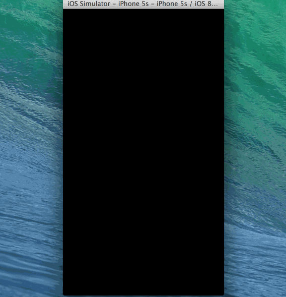

# Yelp Week 3 Submission

This is a week 3 assignment for Yahoo iOS class building a Yelp client.

Time spent: 24 hours spent in total

Completed user stories:

 * [x] Required: Search result page table rows should be dynamic height according to the content height
 * [x] Required: Custom cells should have the proper Auto Layout constraints
 * [x] Required: Search bar should be in the navigation bar
 * [x] Required: Provided filters: sort (best match, distance, highest rated), radius (meters), deals (on/off)
 * [x] Required: Radius filter should expand as in the real Yelp app
 * [x] Required: Clicking on the "Search" button should dismiss the filters page and trigger the search w/ the new filter settings.
 
 * [x] Optional: Implemented a custom switch
  
Walkthrough of all user stories:

GIF created with [LiceCap](http://www.cockos.com/licecap/).
